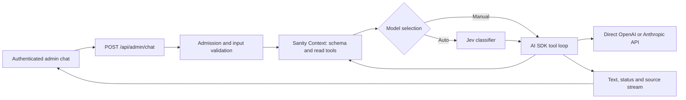

# Admin chat with Sanity Context

Status: backend foundation and service configuration prepared on 24 September 2026. The chat interface is planned below and is not mounted in the admin yet. `ADMIN_CHAT_ENABLED` defaults off.

## Intended experience

Bernardo can ask questions about his experience, roles, assessments and application materials inside the authenticated admin. Answers stream as they are generated and show retrieved sources. Chat is read-only: suggested wording does not save, publish or rescore anything.

The default model choice is **Auto (Jev)**. Bernardo can restrict Auto to OpenAI or Anthropic, or choose an exact supported model. A manual choice bypasses Jev. The response shows the model actually used. Existing document-generation workflows keep their current behavior.

## Service setup completed

- Deployed the existing Studio schema for project `quli96gc`, dataset `production`; no schema migration was needed.
- Created the **Bernardo Fit Admin** Context endpoint in organization `o1hiishuc`, with dataset source `quli96gc.production`:
  `https://api.sanity.io/v1/context/organizations/o1hiishuc/mcp/bernardo-fit-admin`.
- Created a dedicated organization Context Viewer robot token. The management API service-token role is `knowledge-base-viewer-robot`; the similarly named human role is rejected for robots. No browser login is needed for the configured connection.
- Stored `SANITY_CONTEXT_MCP_URL` and `SANITY_ORGANIZATION_TOKEN` in ignored `.env.context.local` and Vercel Production/Preview environment settings. Existing provider, Jev, admin and Redis credentials remain in Vercel. Environment changes apply to new deployments.
- Installed the three Sanity Context setup skills locally, using `npx skills add sanity-io/context --all --yes`. Their examples currently include older endpoint conventions; the current organization endpoint documentation takes precedence.
- Installed the actual shadcn Message Scroller, Message, Bubble and Marker source components. Existing Button and other admin primitives were preserved.
- Pinned compatible AI SDK packages in the lockfile: `ai@7.0.113`, `@ai-sdk/mcp@2.0.57`, `@ai-sdk/openai@4.0.74`, `@ai-sdk/anthropic@4.0.62`. Their shared provider dependency resolves to the same version; numeric package majors need not be identical.

Use GROQ retrieval for the existing structured dataset. A semantic Knowledge Base, embeddings pipeline and new content schema are not prerequisites for this version.

## Implemented backend



| File | Responsibility |
| --- | --- |
| `api/admin/chat.js` | Admin auth, capability discovery, request lifecycle, SSE and cancellation |
| `lib/chat/policy.js` | Accepted request shape, content scope, instructions and limits |
| `lib/chat/context.js` | Organization MCP connection, initial context, read-tool allowlist, source extraction |
| `lib/chat/models.js` | Existing model catalog, Jev decisions, explicit selection, direct provider adapters |
| `lib/chat/agent.js` | Bounded tool loop and per-step usage reporting |
| `lib/chat/admission.js` | Shared Redis request limits, with development memory fallback |
| `scripts/check-chat.mjs` | Credential-presence and read-only Context preflight |
| `tests/test-admin-chat.mjs` | Contract, routing, scope guard, cleanup and real SDK mock-tool-loop tests |

### Requests and streaming contract

Both methods require the existing `x-admin-secret` header. The browser must use the existing session authentication helper; never put secrets in URLs. Responses are private and uncached.

`GET /api/admin/chat` returns `enabled`, `contextConfigured`, `autoAvailable`, and models with IDs, labels, provider and availability. This is configuration discovery, not a live health check. The UI must populate choices from this response.

`POST /api/admin/chat` accepts:

```json
{
  "provider": "auto",
  "model": "auto",
  "messages": [{"role": "user", "content": "Which roles fit my strongest evidence?"}]
}
```

Provider is `auto`, `openai` or `anthropic`. Model is `auto` or an ID from the server catalog. Text history must alternate user/assistant, begin and end with user, contain at most 40 messages, at most 12,000 characters per message and 48 KB of text overall. System messages, credentials and tool results cannot be supplied by the client.

Before streaming, errors are JSON with an HTTP error status. After streaming begins, errors are SSE events and do not change HTTP status. Each event contains one JSON `data` field:

| Event | Data | UI treatment |
| --- | --- | --- |
| `route` | requestId, model, provider, source, policy; optional confidence/reason | Record actual model for this answer |
| `text` | text | Append delta to current assistant message |
| `activity` | state, tool | Map to brief Reading content / Query unsuccessful status |
| `sources` | sources array | Replace source collection for this answer; IDs, types, titles and optional revision/jobId |
| `done` | finishReason, truncated | Mark complete, or show output-limit notice |
| `error` | error, code | Preserve partial text and offer explicit retry |

No raw tool payloads, credentials or hidden reasoning are streamed. The source list records retrieved documents; it is not yet a claim-by-claim citation verifier. Aggregations can legitimately yield no document source entries.

### Routing and operating limits

The catalog reuses the app's Sol, Astra, Sonnet and Opus models. Jev receives the bounded conversation and selects among available models within the provider constraint. Confidence or selected probability below 0.8 chooses Sol, or Opus within an Anthropic-only request. Routing failure gives an explicit error and a manual-selection option; it never silently switches providers. The selected model remains fixed through the turn's tool loop.

Each request has a 180-second deadline, 20-second Context HTTP deadlines, up to six model steps, ten executed read tools and 4,096 output tokens per model step. The last step disables tools so the model can answer with collected evidence. Provider retries are disabled. Redis permits two concurrent requests and 60 admissions per UTC hour; failed setup attempts count. Leases expire after 240 seconds if a process dies. Client disconnect aborts generation; normal completion and errors close MCP and release the lease.

Usage is recorded per completed model step through the existing ledger, with cache reads/writes separated from uncached input. Provider billing for an aborted or failed step can exceed recorded usage if the provider never supplies final usage. Request IDs correlate ledger entries; prompts and transcripts are not added to the ledger by this implementation.

### Content boundary and observed limitation

Read tools are limited to `groq_query` and `schema_explorer`; initial context is fetched once per request. The scope includes candidate profiles/evidence, jobs, questions, assessments, reports, letters, research, interview briefs, site pages and writing guidance. Pending, soft-deleted, draft and release-version documents are excluded by the configured filter. Instructions follow active artifact references, distinguish generated assessments from candidate facts and preserve `legacyId` for app navigation.

**Live finding:** on 24 September, an OR expression in a caller GROQ query returned a document type outside the configured filter. The returned executed query suggested missing parentheses when combining the filter and caller condition. The application therefore conservatively rejects every `||` query before execution, including quoted occurrences; the agent uses `in` or separate queries. A regression test covers this observed case. This guard is not proof against every possible GROQ scope bypass. Keep access admin-only and read-only, and review Sanity's scope behavior before any broader audience. No upstream issue has been filed by this task.

Filters select documents, not private fields within them. The chosen model provider receives retrieved evidence needed to answer, and Jev receives the conversation in Auto mode. Use narrow projections; prompt instructions alone are not field-level access control. Do not introduce public chat using this token or endpoint.

## UI implementation sequence

### 1. Stable admin chat surface

Add a Chat entry to the authenticated admin shell. Mount a dedicated React root that survives legacy workspace rerenders in `src/admin/ui.jsx`; do not mount conversation state in markup replaced whenever the selected job changes. Keep the pipeline and its saved selection intact. Use a spacious dialog/panel on desktop and a full-height surface at narrow widths, with focus return and reachable close controls. An optional selected-role chip must explicitly indicate the question's role context; changing the selected pipeline job must not silently rewrite existing conversation history.

Suggested files: `src/admin/chat/ChatPanel.jsx`, `useAdminChat.js`, `stream.js`, `Sources.jsx`. Wire a stable host from `public/admin.html` and use the existing auth boundary. Keep provider secrets and MCP configuration entirely in server files.

### 2. Message Scroller and composer

Compose installed `MessageScrollerProvider`, `MessageScroller`, `MessageScrollerViewport`, `MessageScrollerContent`, `MessageScrollerItem` and `MessageScrollerButton`, with stable message IDs and the documented anchor behavior. Compose Message/Bubble for user and assistant turns; Marker can identify source references. Reuse Button, Textarea, NativeSelect, Alert and existing tooltips. Match IBM Plex Sans, grey/white surfaces and restrained purple accents in `DESIGN.md`.

Follow streaming output when the user is at the end; preserve position when reading older messages and expose the scroll-to-end button. Keep the composer outside the scrolling message content. Enter sends, Shift+Enter inserts a newline, and IME composition never submits. Give icon actions accessible labels and mobile targets of at least 44 px. Announce meaningful status changes politely rather than every token.

### 3. Provider and model controls

Show a Provider select (Any / OpenAI / Anthropic) and Model select (Auto with Jev / available matching models). Changing providers resets an incompatible model to Auto. Disable unavailable choices with an actionable explanation. Manual selections persist for subsequent turns in this session; each answer retains its actual model badge even if controls later change. Freeze the submitted request's choices during a response while allowing the next draft to be edited.

### 4. Stream transport and lifecycle

Use authenticated `fetch` POST plus `ReadableStream`, `TextDecoder` and an incremental SSE parser. The server uses a custom SSE contract, so `useChat` cannot consume it without a matching transport adapter. Prefer a small focused hook for this text-only version. Handle partial UTF-8 characters, multiple events per chunk, events spanning chunks, CRLF, HTTP JSON errors and EOF before `done`. Batch text updates per animation frame to avoid whole-panel rerenders per token.

States: idle, connecting/routing, reading, streaming, complete, stopped, failed. Stop calls `AbortController.abort()` and preserves partial text marked incomplete. Retry resubmits the same user turn with the previous completed history, replacing the failed attempt rather than duplicating the user message. Do not automatically retry a paid request. Discard late events after stop, retry, New chat, logout or unmount. Keep incomplete turns out of subsequent request history unless deliberately incorporated into a valid user turn. Enforce server history limits before sending; offer New chat instead of silently discarding context.

### 5. Safe rendering and sources

Start with escaped text; if adding Markdown, disable raw HTML and sanitize link protocols. Only create app links from validated source metadata. Job sources with `jobId` can use `/admin?job=<encoded legacyId>&section=overview`; other source types remain labelled references until a verified authenticated destination exists. Do not invent public links from Sanity IDs. Display returned sources as Sources consulted and keep per-answer source state separate.

### 6. History and telemetry

Version one keeps chat in memory for the current open session, with explicit New chat and cleanup on logout. Do not put transcripts in localStorage, URLs, Sanity Insights or logs. Persist only non-sensitive provider/model preferences if desired. Durable chat history is a later feature requiring a conversation schema, access rules, retention/deletion behavior and restore tests. Insights should be a deliberate later addition with transcript handling reviewed, not automatic setup.

## Verification and rollout

Completed: dedicated Context token read connection and query; synthetic streaming through both direct providers; targeted chat, Jev and existing model-routing tests; admin build. The SDK tool round trip is covered with synthetic mocked model/tool data. Real Sanity evidence has not been sent through a model in the setup smoke tests: automatic approval review blocked that combined test, and synthetic provider tests were used instead.

Jev's existing Vercel keys are sensitive and cannot be retrieved for local use. Routing contracts are tested locally; live Auto routing still needs verification in the deployed environment. `npm run chat:check` reports missing local Jev configuration explicitly rather than reporting complete readiness. It performs a read-only Context query and no model generation.

Before enabling the feature:

1. Finish the UI milestones and add targeted parser/lifecycle tests for split events, cancellation, stale streams, history limits and errors.
2. Browser-check 1280, 768, 390 and 360 px; long messages, keyboard operation, mobile composer, scroll anchoring, empty/disabled states, errors, retry and sources. Use synthetic fixtures for visual verification.
3. Verify deployed admin auth, disabled POST behavior, Jev Auto, each provider's manual selection, live streaming, Redis admission and cancellation. A combined private-content/provider test remains outstanding; obtain approval for that test if required by the execution environment.
4. Run full pull-request CI. Enable `ADMIN_CHAT_ENABLED=1` on the tested preview first, then Production only with the finished UI and successful checks. Redeploy after environment changes.

Rollback: unset `ADMIN_CHAT_ENABLED` or set it to `0` and redeploy. POST fails closed while existing app functionality remains available. Revoke the dedicated Sanity robot token if the integration is retired or its credential is compromised.

## References

- [Sanity Context quick start](https://www.sanity.io/docs/ai/sanity-context-quick-start)
- [Configure an MCP](https://www.sanity.io/docs/ai/sanity-context-configure-mcp)
- [Context MCP reference](https://www.sanity.io/docs/ai/sanity-context-mcp)
- [Content access and security](https://www.sanity.io/docs/ai/sanity-context-security)
- [Sanity Context with Vercel AI SDK](https://www.sanity.io/docs/ai/sanity-context-vercel-ai-sdk)
- [shadcn Message Scroller](https://ui.shadcn.com/docs/components/radix/message-scroller)
