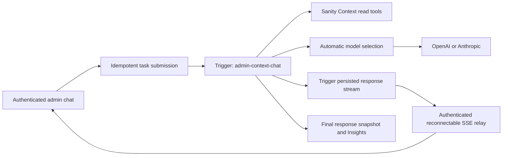

# Admin chat with Sanity Context

Status: Trigger task migration implemented and locally verified; cloud deployment awaits approval to upload the source bundle. The existing preview has not been updated with this migration.

Original setup: backend, service configuration and admin chat interface implemented on 24 September 2026. The interface is mounted separately from legacy workspace renders and available from the authenticated Chat launcher. `ADMIN_CHAT_ENABLED` defaults off; rollout is controlled per environment.

UI implementation: `src/admin/chat/ChatPanel.jsx`, `stream.js`, `transport.js` and `chat.css`. Uses installed shadcn Message Scroller, Message/Bubble, Dialog, Textarea and Button. Renders safe Markdown, validates source links, retains drafts across closing, supports Stop/Retry/New chat, recovers active work after reload, and clears browser session state on session expiry. `tests/test-chat-stream.mjs` covers fragmented UTF-8/SSE and history limits. `npm run test:chat-ui` exercises synthetic streaming, automatic Jev routing, Markdown, sources, stop/retry, session expiry, disabled state and accessibility at 1280/768/390/360 px. Below is the design and rollout reference for the implemented feature; optional selected-role context and durable-history browsing are future additions.

## Intended experience

Bernardo can ask questions about his experience, roles, assessments and application materials inside the authenticated admin. Answers stream as they are generated and show retrieved sources. Chat is read-only: suggested wording does not save, publish or rescore anything.

Jev automatically chooses the provider and model for each question and retry. The chat UI always submits `provider: auto` and `model: auto`, with no selection controls or model badges. Existing document-generation workflows keep their current behavior.

## Service setup completed

- Deployed the existing Studio schema for project `quli96gc`, dataset `production`; no schema migration was needed.
- Created the **Bernardo Fit Admin** Context endpoint in organization `o1hiishuc`, with dataset source `quli96gc.production`:
  `https://api.sanity.io/v1/context/organizations/o1hiishuc/mcp/bernardo-fit-admin`.
- Created a dedicated organization Context Viewer robot token. The management API service-token role is `knowledge-base-viewer-robot`; the similarly named human role is rejected for robots. No browser login is needed for the configured connection.
- Stored `SANITY_CONTEXT_MCP_URL` and `SANITY_ORGANIZATION_TOKEN` in ignored `.env.context.local` and Vercel Production/Preview environment settings. Existing provider, Jev, admin and Redis credentials remain in Vercel. Environment changes apply to new deployments.
- Installed the three Sanity Context setup skills locally, using `npx skills add sanity-io/context --all --yes`. Their examples currently include older endpoint conventions; the current organization endpoint documentation takes precedence.
- Installed the actual shadcn Message Scroller, Message, Bubble and Marker source components. Existing Button and other admin primitives were preserved.
- Pinned compatible AI SDK packages in the lockfile: `ai@7.0.113`, `@ai-sdk/mcp@2.0.57`, `@ai-sdk/openai@4.0.74`, `@ai-sdk/anthropic@4.0.62`. Their shared provider dependency resolves to the same version; numeric package majors need not be identical.

Use GROQ retrieval for the existing structured dataset. A semantic Knowledge Base, embeddings pipeline and new content schema are not prerequisites for this version.

## Implemented backend

| File | Responsibility |
| --- | --- |
| `api/admin/chat.js` | Admin auth, idempotent dispatch, receipted run access, SSE relay and explicit cancellation |
| `src/trigger/admin-chat.ts` | Two-slot queue, one paid attempt, 210-second worker budget, response stream |
| `lib/chat/work.js` | Context, Jev, model streaming, sanitized snapshots and Insights persistence |
| `tests/test-chat-durable.mjs` | Ambiguous dispatch, receipt ownership, reconnect cursor, cancellation and crash recovery |
| `lib/chat/policy.js` | Accepted request shape, content scope, instructions and limits |
| `lib/chat/context.js` | Organization MCP connection, initial context, read-tool allowlist, source extraction |
| `lib/chat/models.js` | Existing model catalog, Jev decisions, explicit selection, direct provider adapters |
| `lib/chat/agent.js` | Bounded tool loop and per-step usage reporting |
| `lib/chat/admission.js` | Shared Redis request limits, with development memory fallback |
| `scripts/check-chat.mjs` | Credential-presence and read-only Context preflight |
| `tests/test-admin-chat.mjs` | Contract, routing, scope guard, cleanup and real SDK mock-tool-loop tests |

### Requests and streaming contract

Both methods require the existing `x-admin-secret` header. The browser must use the existing session authentication helper; never put secrets in URLs. Responses are private and uncached.

`GET /api/admin/chat` returns availability flags including `workerConfigured`. The app always submits automatic routing. `ADMIN_CHAT_WORKER_READY=1` is required after deploying a matching worker; Preview requires a preview key and branch.

`POST /api/admin/chat` accepts a UUID `requestId`, UUID `conversationId`, and alternating text `messages`. It returns 202 with a run ID. A global, 30-day Trigger idempotency key recovers ambiguous submissions; receipts bind the ID to the exact request hash. Reusing it with different content fails. The endpoint and worker force automatic Jev routing. Existing limits remain 40 messages, 12,000 characters per message and 48 KB overall.

`GET /api/admin/chat?run=<id>&cursor=<next-chunk>` relays the Trigger response stream, after checking its chat receipt. A disconnected browser cancels only this subscription. Connections rotate after 45 seconds; reconnects resume by sequence number. Completed runs return their final response snapshot even if their stream has expired. Crashed, expired and cancelled runs return safe terminal states. Raw task errors never reach the client.

`POST /api/admin/chat` with `{action: "stop", runId}` cancels that receipted task. The UI remains locked until terminal status is confirmed. Closing the dialog or reloading does not cancel work.

Events are `activity` (phase), `route` (request ID only), `text` (delta), `sources`, `snapshot` (text, sources, status, storage and safe error) and `done`. Persisted chunks carry `seq`; the browser stores its next cursor with the partial answer. Missing network events cause reconnection, not a new generation. A failed paid attempt requires explicit Retry with a new request ID.

No raw tool payloads, credentials or hidden reasoning are streamed. The source list records retrieved documents; it is not yet a claim-by-claim citation verifier. Aggregations can legitimately yield no document source entries.

### Routing and operating limits

The catalog reuses the app's Sol, Astra, Sonnet and Opus models. Jev receives the bounded conversation and selects among available models within the provider constraint. Confidence or selected probability below 0.8 chooses Sol, or Opus within an Anthropic-only request. Routing failure gives an explicit error and the UI offers retry; it never silently switches providers. The selected model remains fixed through the turn's tool loop.

Each request has a 180-second deadline, 20-second Context HTTP deadlines, up to six model steps, ten executed read tools and 4,096 output tokens per model step. The last step disables tools so the model can answer with collected evidence. Provider retries are disabled. Redis permits two concurrent requests and 60 admissions per UTC hour; failed setup attempts count. Leases expire after 240 seconds if a process dies. The Trigger task runs independently of browser connections and has a 210-second overall limit plus a five-minute queue TTL. Responses are capped at 100,000 characters. Normal completion and errors close MCP and release the lease. Task retries are disabled to avoid duplicate paid answers after worker crashes; explicit Retry starts a new turn attempt.

Usage is recorded per completed model step through the existing ledger, with cache reads/writes separated from uncached input. Provider billing for an aborted or failed step can exceed recorded usage if the provider never supplies final usage. Request IDs correlate ledger entries; prompts and transcripts are not added to the ledger by this implementation.

### Content boundary and observed limitation

Read tools are limited to `groq_query` and `schema_explorer`; initial context is fetched once per request. The scope includes candidate profiles/evidence, jobs, questions, assessments, reports, letters, research, interview briefs, site pages and writing guidance. Pending, soft-deleted, draft and release-version documents are excluded by the configured filter. Instructions follow active artifact references, distinguish generated assessments from candidate facts and preserve `legacyId` for app navigation.

**Live finding:** on 24 September, an OR expression in a caller GROQ query returned a document type outside the configured filter. The returned executed query suggested missing parentheses when combining the filter and caller condition. The application therefore conservatively rejects every `||` query before execution, including quoted occurrences; the agent uses `in` or separate queries. A regression test covers this observed case. This guard is not proof against every possible GROQ scope bypass. Keep access admin-only and read-only, and review Sanity's scope behavior before any broader audience. No upstream issue has been filed by this task.

Filters select documents, not private fields within them. The chosen model provider receives retrieved evidence needed to answer, and Jev receives the conversation in Auto mode. Use narrow projections; prompt instructions alone are not field-level access control. Do not introduce public chat using this token or endpoint.

## UI implementation sequence

### 1. Stable admin chat surface

Add a Chat entry to the authenticated admin shell. Mount a dedicated React root that survives legacy workspace rerenders in `src/admin/ui.jsx`; do not mount conversation state in markup replaced whenever the selected job changes. Keep the pipeline and its saved selection intact. Use a spacious dialog/panel on desktop and a full-height surface at narrow widths, with focus return and reachable close controls. An optional selected-role chip must explicitly indicate the question's role context; changing the selected pipeline job must not silently rewrite existing conversation history.

Suggested files: `src/admin/chat/ChatPanel.jsx`, `useAdminChat.js`, `stream.js`, `Sources.jsx`. Wire a stable host from `public/admin.html` and use the existing auth boundary. Keep provider secrets and MCP configuration entirely in server files.

### 2. Message Scroller and composer

Compose installed `MessageScrollerProvider`, `MessageScroller`, `MessageScrollerViewport`, `MessageScrollerContent`, `MessageScrollerItem` and `MessageScrollerButton`, with stable message IDs and the documented anchor behavior. Compose Message/Bubble for user and assistant turns; Marker can identify source references. Reuse Button, Textarea, Alert and existing tooltips. Match IBM Plex Sans, grey/white surfaces and restrained purple accents in `DESIGN.md`.

Follow streaming output when the user is at the end; preserve position when reading older messages and expose the scroll-to-end button. Keep the composer outside the scrolling message content. Enter sends, Shift+Enter inserts a newline, and IME composition never submits. Give icon actions accessible labels and mobile targets of at least 44 px. Announce meaningful status changes politely rather than every token.

### 3. Automatic routing

Send every question and retry to Jev for automatic provider/model selection. Keep routing details behind the scenes. Disable sending if Jev or all providers are unavailable; report a concise availability error. The chosen model stays fixed during that response while the next draft remains editable.

### 4. Stream transport and lifecycle

Use authenticated `fetch` POST plus `ReadableStream`, `TextDecoder` and an incremental SSE parser. The server uses a custom SSE contract, so `useChat` cannot consume it without a matching transport adapter. Prefer a small focused hook for this text-only version. Handle partial UTF-8 characters, multiple events per chunk, events spanning chunks, CRLF, HTTP JSON errors and EOF before `done`. Batch text updates per animation frame to avoid whole-panel rerenders per token.

States: idle, connecting/routing, reading, streaming, complete, stopped, failed. Stop requests server-side task cancellation and preserves partial text marked incomplete after confirmation. Connection loss displays Reconnecting and keeps the action locked. Retry resubmits the same user turn with the previous completed history, replacing the failed attempt rather than duplicating the user message. Do not automatically retry a paid request. Discard late events after a terminal stop, retry, New chat, logout or unmount. Keep incomplete turns out of subsequent request history unless deliberately incorporated into a valid user turn. Enforce server history limits before sending; offer New chat instead of silently discarding context.

### 5. Safe rendering and sources

Render assistant text with react-markdown and remark-gfm, with raw HTML disabled and safe link protocols. Suppress remote images; wrap tables and code blocks for horizontal scrolling. User messages remain escaped plain text. Only create app links from validated source metadata. Job sources with `jobId` can use `/admin?job=<encoded legacyId>&section=overview`; other source types remain labelled references until a verified authenticated destination exists. Do not invent public links from Sanity IDs. Display returned sources as Sources consulted and keep per-answer source state separate.

### 6. History and telemetry

The user explicitly enabled stored transcripts and Insights. `lib/chat/insights.js` now saves user/assistant text to the organization's Context store. The browser supplies a UUID `conversationId` (or adopts the one returned by `route`) and retains it across turns. Each request saves an immutable full-history snapshot under `admin-chat.<requestId>`, grouped by conversationId metadata. This avoids late-request overwrites and lets each new turn be classified even when earlier turns already have verdicts. Insights metrics are per turn snapshot, not unique conversations. Raw tool results and hidden reasoning are excluded; Sanity's optional telemetry sharing remains off.

`ADMIN_CHAT_INSIGHTS_ENABLED=1` enables saving with the separate `SANITY_CONTEXT_WRITE_TOKEN` Context Editor credential. Completed, truncated, stopped and failed turns are labelled. The final snapshot reports `storage: saved` or `failed` before `done`; a save failure preserves the answer and shows a local notice. Rejected admissions are not stored. Per the user’s updated preference, the footer displays processing status instead of a permanent storage notice. Forced worker termination may prevent final transcript saving; cancellation persistence is best effort. No expiry has been configured: saved transcripts remain until explicitly deleted from the Context store. Do not put transcripts in localStorage, URLs or application logs. The current browser tab restores its conversation and active run from sessionStorage; cross-session history browsing and deletion controls still need implementation; Insights storage alone does not provide those UI features.

The organization-scoped `bernardo-admin-chat` Blueprint defines an hourly classifier; Sanity's current plan rejects more frequent schedules. Per the user's choice, it processes up to three idle snapshots per run using **Jev (`jev-1.13.0`)**, with a 360-second function deadline and 30-second classification requests. It uses Jev's native score/choice/noul API and Sanity's direct classification API; no generative-model adapter or second AI SDK version is needed. Success scores map from Jev's zero-based rubric to Sanity's 1–10 scale. Sentiment is positive/neutral/negative. Content gaps use eight domain categories and a probability threshold of 0.8; this provides consistent labels but does not discover arbitrary new topic names. Classifier failures are recorded safely rather than automatically retried; inspect them in Context Insights before explicit reprocessing. Backlog remains pending for later runs.

The classifier uses a separate Context Editor token and the existing Jev credential. It sends stored transcripts to Jev for classification, as requested. OpenAI/Anthropic remain available for answering questions. Optional Sanity telemetry sharing is disabled. The initial Anthropic classification deployment was rejected by automatic approval review; the user subsequently selected Jev, and the implementation was changed accordingly.

Synthetic retrieval, missing-evidence and document-instruction evaluations are available through `npm run chat:evaluate` (paid provider calls; no real Sanity content). Optional arguments restrict provider and scenario. These are focused behavioral checks, not a comprehensive safety evaluation.

## Verification and rollout

Completed: dedicated Context token read connection and query; synthetic streaming through both direct providers; targeted chat, Jev and existing model-routing tests; admin build. The SDK tool round trip is covered with synthetic mocked model/tool data. Real Sanity evidence has not been sent through a model in the setup smoke tests: automatic approval review blocked that combined test, and synthetic provider tests were used instead.

The existing Jev key was obtained from the authorized Trigger environment and stored only in the ignored local environment and the classification function. `npm run chat:check` now passes with both providers, Jev and Context configured. It performs a read-only Context query and no model generation. Synthetic live Jev classification was saved successfully into Insights, and six synthetic provider/tool evaluations pass. Anthropic sometimes describes an ignored injected instruction while still answering correctly; this verbosity remains a tuning opportunity.

Before deploying this Trigger migration:

1. Approve uploading the source bundle to Trigger.dev, then deploy `admin-context-chat` to preview branch `codex/sanity-context-chat-setup`. Configure that worker with the existing OpenAI/Anthropic, Jev, Redis and Sanity Context read/write credentials, `ADMIN_CHAT_INSIGHTS_ENABLED=1`, and matching `KV_NAMESPACE`. Never put the admin secret in the task payload.
2. Browser-check 1280, 768, 390 and 360 px; long messages, keyboard operation, mobile composer, scroll anchoring, empty/disabled states, errors, retry and sources. Use synthetic fixtures for visual verification.
3. Verify deployed admin auth, disabled POST behavior, automatic Jev routing, live streaming, Redis admission, reconnect and cancellation. A combined private-content/provider test remains outstanding; obtain approval for that test if required by the execution environment.
4. Set the matching Trigger preview key and branch in Vercel, enable `ADMIN_CHAT_WORKER_READY=1`, and run full pull-request CI. Enable `ADMIN_CHAT_ENABLED=1` on the tested preview first, then Production only with the finished UI and successful checks. Redeploy after environment changes.

Rollback: unset `ADMIN_CHAT_ENABLED` or set it to `0` and redeploy. POST fails closed while existing app functionality remains available. Revoke the dedicated Sanity robot token if the integration is retired or its credential is compromised.

## References

- [Sanity Context quick start](https://www.sanity.io/docs/ai/sanity-context-quick-start)
- [Configure an MCP](https://www.sanity.io/docs/ai/sanity-context-configure-mcp)
- [Context MCP reference](https://www.sanity.io/docs/ai/sanity-context-mcp)
- [Content access and security](https://www.sanity.io/docs/ai/sanity-context-security)
- [Sanity Context with Vercel AI SDK](https://www.sanity.io/docs/ai/sanity-context-vercel-ai-sdk)
- [shadcn Message Scroller](https://ui.shadcn.com/docs/components/radix/message-scroller)
