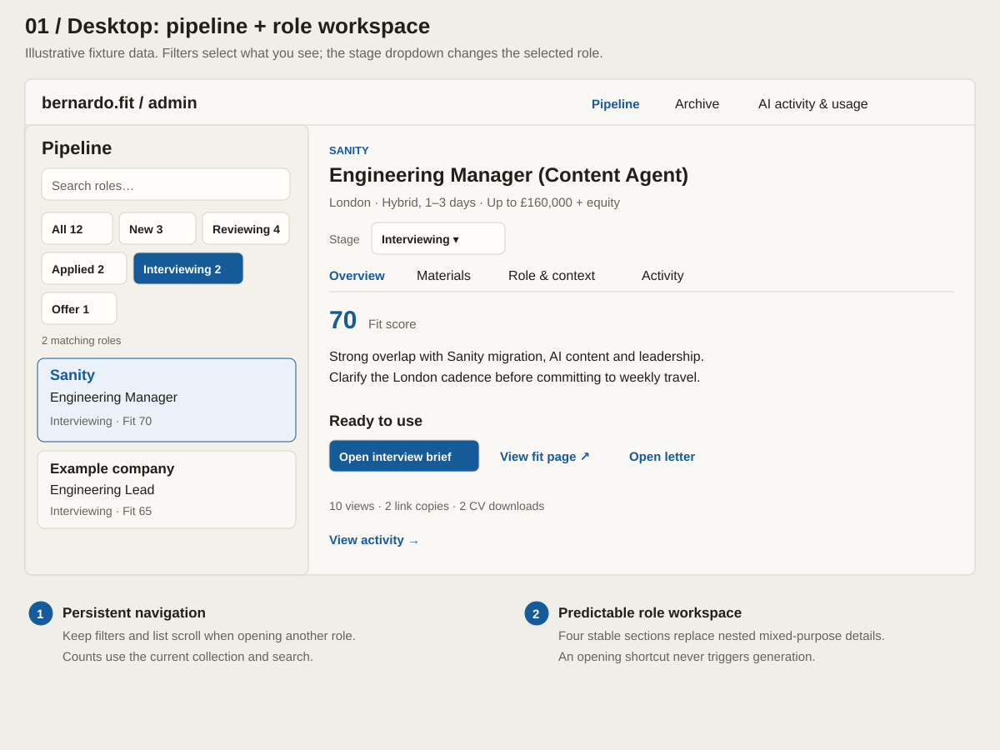
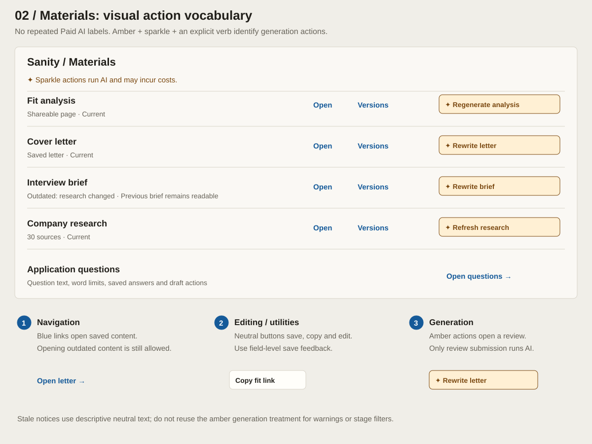
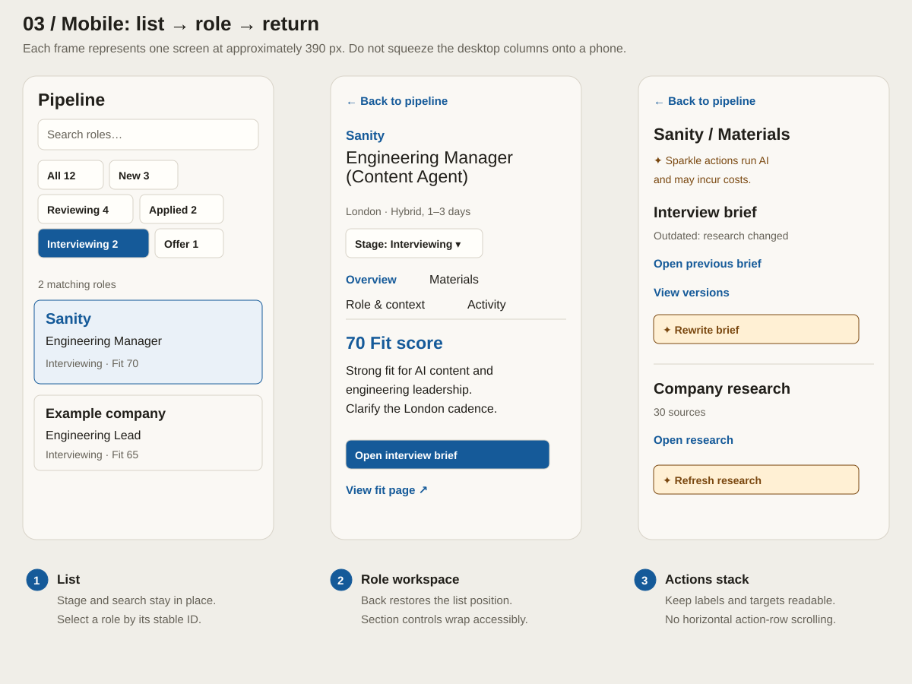
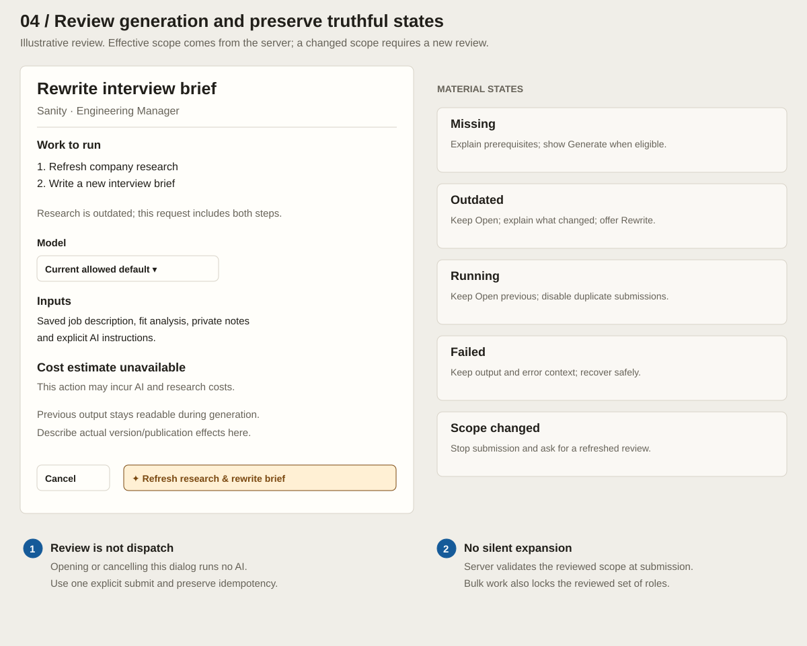

# Admin UX visual implementation guide

Use alongside [the implementation plan](../admin-ux-implementation-plan.md). These annotated wireframes specify layout hierarchy and interaction intent, not completed functionality or pixel-perfect screenshots. Counts, example companies, and review state are illustrative fixtures. Real stages, freshness, scope, costs and output availability come from the application.

The SVG sources are editable, self-contained and readable on GitHub. Companion PNGs show the same guides for image viewers. Do not implement screenshot text as hard-coded application data. The latest user decision is represented here: **amber sparkle generation buttons, without repeated Paid AI labels**.

## 1. Desktop pipeline and workspace

- Left: full-width search followed by one compact stage dropdown, then dense role entries. Right: one selected role and its four sections. These two control rows replace the wrapping chip grid.
- The Filter by stage dropdown changes the list filter; its visible value includes the selected stage and count. The separately labelled Stage dropdown in the workspace edits the role. The two must never share a mutation handler.
- Filter counts match the current collection and search before applying the stage filter. The illustrative dropdown options are All stages (15), New (3), Reviewing (4), Applied (2), Interviewing (5) and Offer (1). All five visible entries match Interviewing.
- Keep the search/filter block sticky while entries scroll underneath it. Remove the separate matching-roles count line. No additional Filters button is needed for the current feature set.
- Use company and fit score on line one, role on line two. Omit repeated Interviewing labels in this filtered view; restore stage metadata in All stages. Allow wrapping for long titles.
- Keep Overview focused on evaluating the opportunity and opening existing work. Generation belongs in Materials, not a competing toolbar below every pipeline row.
- Fit score must retain an accessible route to its explanation; hover alone is insufficient.
- When a stage change removes the current role from the list, keep its workspace with an explanatory notice and a return action. Do not switch to another role unexpectedly.

[PNG version](01-desktop-workspace.png)

## 2. Materials and action styling

- Use one nearby explanation: “Sparkle actions run AI and may incur costs.” Do not add the text to every button.
- Blue links read or navigate; neutral buttons edit, save and copy; amber sparkle buttons open the generation review. The final submit uses the same amber treatment.
- Keep explicit verbs. “Rewrite letter” is a generation action; “Open letter” is a read action. “Cover letter” alone is not an adequate action label.
- An outdated brief still has Open. Do not make opening depend on research freshness.
- Versions navigates to the corresponding output group in Activity. Preview and activation are distinct actions.
- The word “Current” is a fixture state, not a new independent freshness calculation. Use existing backend freshness rules.

[PNG version](02-materials-actions.png)

## 3. Mobile navigation

- The three frames are separate screens, not three columns on a device.
- Back to pipeline restores stage, search and scroll. Browser Back must work too. Keep the same two compact control rows and sticky behaviour on mobile; do not restore wrapping stage chips.
- Collapse to one pane when the two desktop columns cannot fit comfortably. Start evaluating a breakpoint around 900 px; decide from actual content fit, not device names.
- Wrap the four section controls, or use an equally discoverable accessible pattern. Keep their names consistent across widths.
- Stack output actions before labels become cramped. Avoid horizontal action scrolling and hover-dependent controls.
- The scaled frames demonstrate composition. Production mobile controls should have at least 44 px touch targets; do not copy scaled drawing measurements literally.

[PNG version](03-mobile-navigation.png)

## 4. Generation review and states

- The example intentionally needs fresh research. If research is reusable, show brief-only scope and the matching submit verb instead.
- The displayed model must resolve to an actual allowed model, not only the illustrative “Current allowed default” placeholder.
- Explain actual input and publication/version effects for each operation. The wireframe's instruction to describe those effects is an annotation for implementers, not product copy.
- Private notes may feed interview preparation. Do not describe them as excluded from AI context.
- Use truthful unavailable-cost copy when no reliable estimate exists. Do not invent a range for visual completeness.
- Open, Cancel and Escape have no generation side effects. Submit validates the reviewed scope on the server; it must not silently add research.
- On mobile, use a full-width review surface with a scrollable body and reachable actions. If actions are sticky, they must not obscure content or focused controls.
- The state cards are implementation annotations; do not add them as permanent dashboard panels.

[PNG version](04-generation-review.png)

## 5. Section composition beyond the drawings

| Section | Top-to-bottom composition | Key interaction |
| --- | --- | --- |
| Overview | Score and explanation; rationale/concerns; reply-owed or freshness notice when applicable; existing-material shortcuts; engagement summary | Reading and evaluation; keep routine generation out of this section |
| Materials | Output rows; application question editor/list | Put local open/copy/version/generate actions beside their output |
| Role & context | Editable role details/source; labelled job description editor; private notes; AI instructions | Each editor has its own save status; use plain help text to explain generation input use |
| Activity | Run outcomes and recorded costs when available; engagement; version groups per output | Deep links from Materials select the matching version group; preview does not activate |

Role & context should use one readable main column. Give notes and AI instructions distinct headings and descriptions rather than adjacent anonymous textareas. Show Save errors beside the relevant input and retain draft text. Do not hide primary editors inside another all-purpose details accordion.

Activity should group history by purpose, using compact lists or tables with clear headings. Keep archive/restore actions separate from generation history. Do not fill unavailable history with sample events in production.

## 6. Starting layout and typography values

These are implementation starting points; preserve existing font assets and adjust after browser verification.

| Element | Starting point |
| --- | --- |
| Desktop shell | Approximately 1200–1440 px maximum width, fluid side padding of 24–32 px |
| Pipeline column | Approximately 300–340 px, leaving the workspace flexible |
| Workspace padding | 24–32 px desktop; 16–20 px mobile |
| Spacing rhythm | 4, 8, 12, 16, 24 and 32 px |
| Role heading | 24–28 px, existing Schibsted Grotesk |
| Body and inputs | 15–16 px, existing IBM Plex Sans; readable line height around 1.5 |
| Secondary metadata | 13–14 px; reserve mono for compact identifiers or technical metadata |
| Pipeline entries | Two-line baseline, approximately 10–12 px vertical padding; allow growth for long titles, mixed-stage metadata and attention indicators |
| Search/filter block | Two control rows with an 8 px gap; at least 44 px mobile targets; sticky within the list scroll region |
| Output rows | Approximately 16–20 px vertical padding, subtle horizontal dividers |
| Controls | Modest 6–8 px corner radius; at least 44 px mobile touch targets |
| Focus | Visible 2 px outline with offset, checked against adjacent colours |

Avoid turning every sentence into a card. Use whitespace, headings and dividers for structure. Use one strong blue opening shortcut on Overview; the other read actions can be links. The closed stage filter uses a neutral dropdown treatment and includes its count; reserve blue selection emphasis for the selected role and active navigation.

## 7. Colour and icon reference

| Purpose | Light-theme starting value | Usage |
| --- | --- | --- |
| Paper | `#FAF8F4` | App background |
| Surface | `#FFFEFA` | Inputs and review surfaces |
| Main text | `#211F1A` | Headings and body |
| Secondary text | `#666258` | Metadata and help text |
| Divider | `#D8D3C8` | Structural boundaries, not sole control affordance |
| Navigation blue | `#155A99` | Links, selected controls, focus |
| Selected-row wash | `#EAF1F8` | Selected pipeline role |
| Generation surface | `#FFF0D4` | Amber generation buttons only |
| Generation text/border | `#7A4810` | Sparkle, verb and border on generation buttons |
| Destructive text | `#A02929` | Explicit destructive actions/errors, verified in context |

Use a consistent sparkle icon asset in production. The SVG glyph is schematic, not a requirement to use a font character. Decorative icons should be hidden from assistive technology; link the generation control to the visible explanatory text with an accessible description. Verify WCAG contrast, focus and forced-colour behaviour in the actual implementation. These light-theme guides do not require adding a new theme system.

## 8. Visual verification checklist

- At 1280 px, the selected role has sufficient reading width and search plus one stage dropdown consume only two control rows. No separate matching-count line or extra Filters button is present.
- During long-list scrolling, search and stage remain visible and keyboard-focused entries are not covered. Compare the number of visible entries against the prior chip layout at the same viewport.
- In a specific-stage view, rows omit duplicate stage labels; switching to All stages restores them.
- At 768 px and 360–390 px, the interface becomes one pane without clipped labels or horizontal action overflow.
- Long company names, missing salaries and multiline role titles do not displace stage controls or truncate essential meaning.
- A user can identify opening, editing and generation actions without colour, using verbs and the sparkle convention.
- Every production action is wired; these static guides are not a substitute for functional testing.
- Save feedback and run updates do not steal focus or discard draft edits.
- Compare keyboard, touch, missing, stale, running and failed states against the implementation plan's acceptance matrix.

## Updating the guide

Keep SVG and PNG companions in sync. PNGs are rendered at the SVG's intrinsic size. Update the accessible SVG title/description and this commentary if a design changes. A guide change must not silently override a later user decision or existing application semantics.
