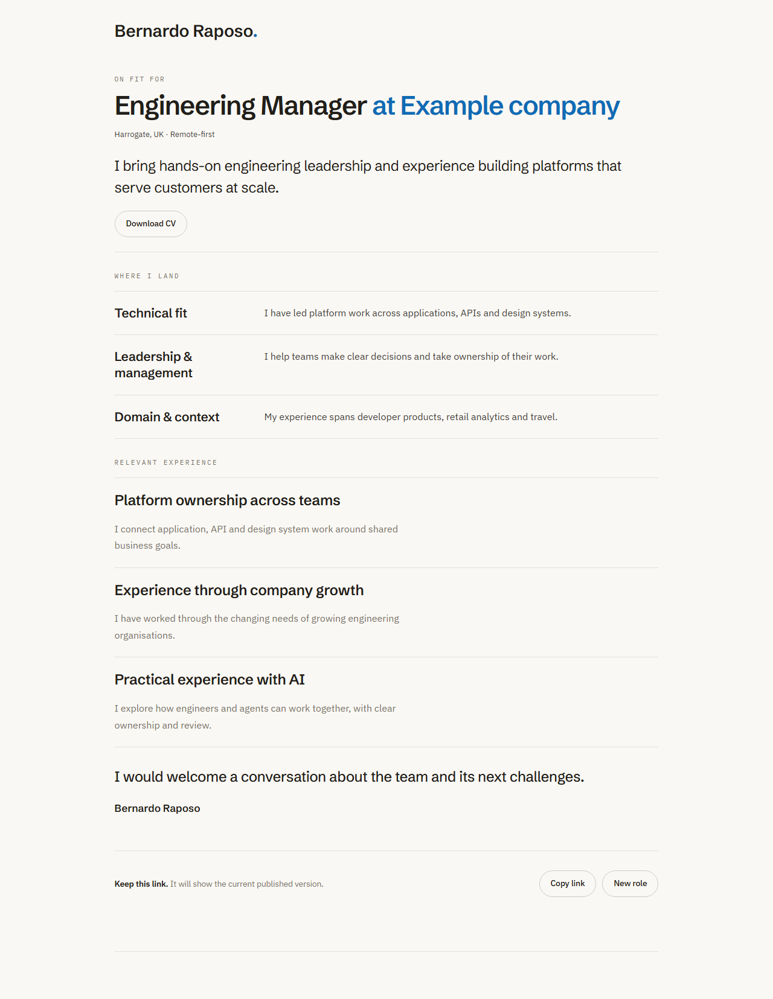
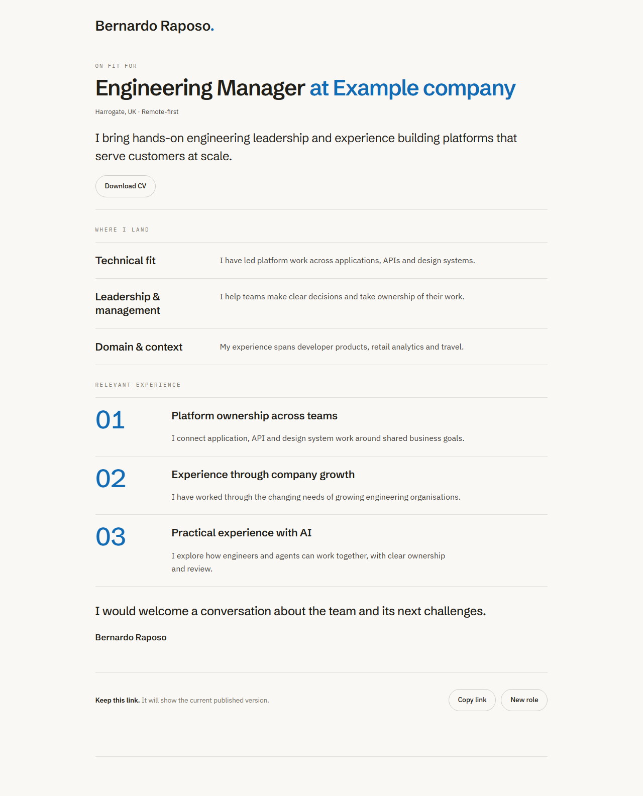

# Fit report typography comparison

PR #43 restores experience numbering and matches the two sections' title and body typography.

- Before: `9e12b33` (PR base).
- After: `11ed73d` (UI change; subsequent commits add documentation and screenshots only).
- Desktop viewport: 1280 × 1400; mobile viewport: 390 × 844. Images capture the full page.
- Both revisions use identical synthetic report content with three categories and three differentiators, the same demo state and initial scroll position.
- Chromium, reduced motion enabled, Google Fonts loaded and `document.fonts.ready` awaited. Desktop and mobile captures visually inspected.
- API/realtime modules are stubbed; no live report data or paid generation is used. These captures verify presentation, not backend behaviour.

| Viewport | Before | After |
| --- | --- | --- |
| Desktop |  |  |
| Mobile |  |  |
